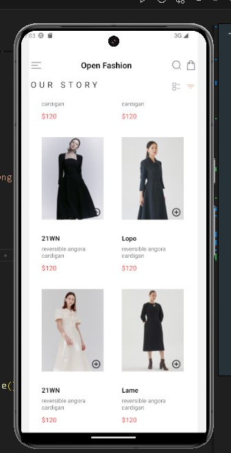
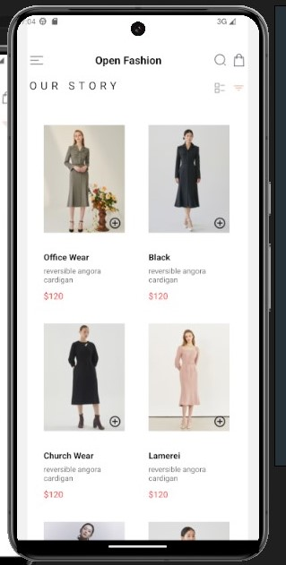
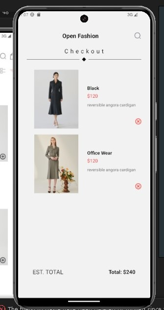
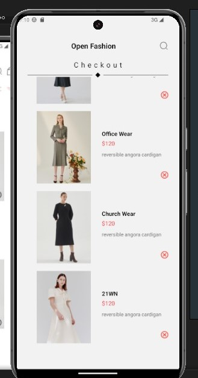

# Shopping Cart

# Overview

Open Fashion is a simple e-commerce mobile application developed using React Native. The app allows users to view a list of fashion products, add them to a cart, and view or remove items from the cart.

# Design Functionalities

- Each product item includes an image, title, description, price, and an "Add to Cart" button in the Homescreen.
- The "Add to Cart" button is designed as a plus icon located at the bottom right of each product card.
- Each cart item includes an image, title, price, and a "Remove" button in the Checkout interface
- The total price of all items in the cart is displayed at the bottom of the screen.
- The application uses AsyncStorage to store the cart data locally on the device.
- This allows users to maintain their cart items between app sessions.

# Installation and Setup

- git clone https://github.com/koadipah/rn-assignment6-11288153.git
- cd Mev
- npm install
- npm run app

# Screenshot

